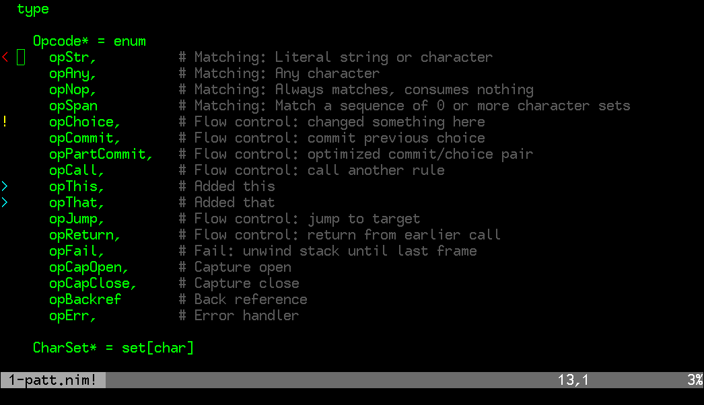

# Introduction

NOTE: This plugin is unix-only!

An small vim 7.0 plugin for showing RCS diff information in a file while
editing. This plugin runs a diff between the current buffer and the original
file from the version control system, and shows coloured signs indicating
where the buffer differs from the original file from the repository. The
original text is not shown, only signs are used to indicate where changes were
made. With proper key bindings configured, fast navigation between changed
blocks is also provided.

This plugin supports the following RCS systems:

- CVS
- Fossil
- Git
- Mercurial
- Perforce / p4
- Subversion

The type of RCS will be detected when first issuing a rcdiff command on 
the file.

The following symbols and syntax highlight groups are used for the signs:

  > DiffAdd:    Newly added lines. (default=blue)

  ! DiffChange: Lines which are changed from the original. (default=cyan)

  < DiffDel:    Applied to the lines directly above and below a deleted block
                (default=magenta) 

# Usage

The plugin defines one function: Svndiff(). This function figures out the
difference between the current buffer and it's RCS original, and adds the
signs at the places where the buffer differs from the original file from svn
or git. You'll need to call this function after making changes to update the
highlighting.

The function takes one argument specifying an additional action to perform:

  "prev"  : jump to the previous different block 
  "next"  : jump to the next different block
  "clear" : clean up all signs

You might want to map some keys to run the Svndiff function. For
example, add to your .vimrc:

  noremap <F3> :call Svndiff("prev")<CR> 
  noremap <F4> :call Svndiff("next")<CR>
  noremap <F5> :call Svndiff("clear")<CR>

# Configuration

The following configuration variables are availabe:

* g:rcdiff_autoupdate

  If this variable is defined, rcdiff will automatically update the signs
  when the user stops typing for a short while, and when leaving insert
  mode. This might slow things down on large files, so use with caution.
  The vim variable 'updatetime' can be used to set the auto-update interval,
  but note that changing this variable other effects as well. (refer to the 
  vim docs for more info) 
  To use, add to your .vimrc:

  let g:rcdiff_autoupdate = 1

* g:rcdiff_one_sign_delete

  Normally, two 'delete' signs are placed around the location where
  text was deleted. When this variable is defined, only one sign is
  placed, above the location of the deleted text.
  To use, add to your .vimrc:

  let g:rcdiff_one_sign_delete = 1

# Colors

Personally, I find the following colours more intuitive for diff colours:
red=deleted, green=added, yellow=changed. If you want to use these colours,
try adding the following lines to your .vimrc

hi DiffAdd      ctermfg=0 ctermbg=2 guibg='green'
hi DiffDelete   ctermfg=0 ctermbg=1 guibg='red'
hi DiffChange   ctermfg=0 ctermbg=3 guibg='yellow'
